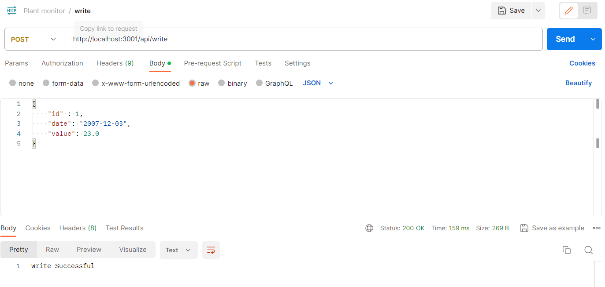
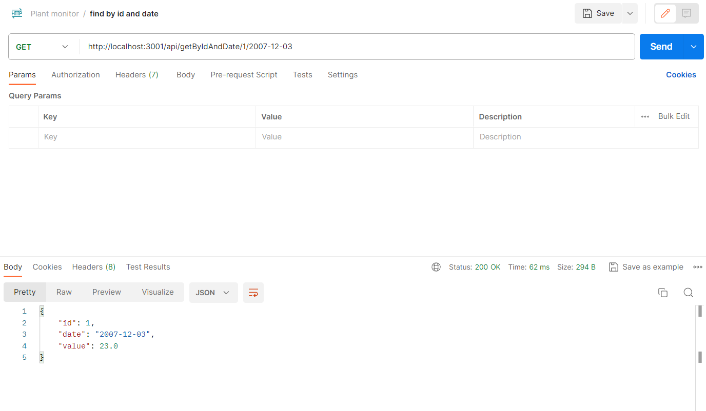
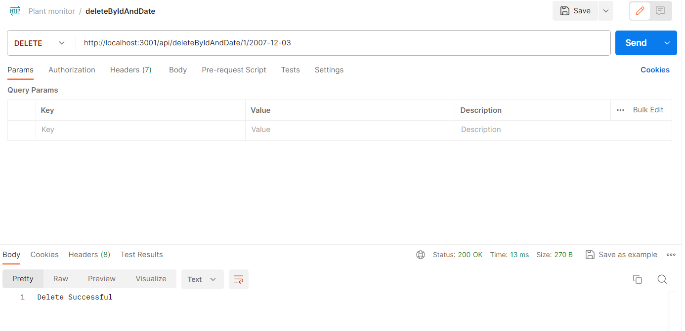
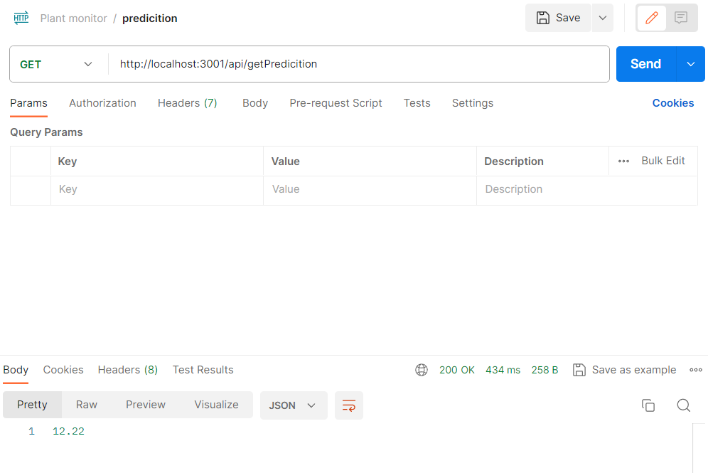

<h3 align="center">Plant Monitor REST API</h3>


<!-- TABLE OF CONTENTS -->
<details>
  <summary>Table of Contents</summary>
  <ol>
    <li>
      <a href="#about-the-project">About The Project</a>
      <ul>
        <li><a href="#built-with">Built With</a></li>
      </ul>
    </li>
    <li>
      <a href="#getting-started">Getting Started</a>
      <ul>
        <li><a href="#prerequisites">Prerequisites</a></li>
        <li><a href="#installation">Installation</a></li>
      </ul>
    </li>
    <li><a href="#license">License</a></li>
  </ol>
</details>


<!-- ABOUT THE PROJECT -->
## About The Project

This is the backend of plant monitor project (https://github.com/Athavaloshan/plant-monitor). Sensor data and yield prediction is exposed as REST API. The Mobile frontend consume these services.
<p align="right">(<a href="#readme-top">back to top</a>)</p>


### Built With

* Java
* Spring Boot
* Maven

<p align="right">(<a href="#readme-top">back to top</a>)</p>


<!-- GETTING STARTED -->
## Getting Started


### Prerequisites
* Java
* Spring Boot
* Maven
  
### Installation

1. Clone the repo
   ```sh
   git clone https://github.com/Athavaloshan/plant-monitor-backend.git
   ```
2. Install JAVA and set path environment varaible to point your JAVA installation.
3. Install Maven and set path environment varaible to point your Maven installation.
4. Open powershell and change the directory to plant-monitor-backend.
5. run the following command
   ```sh
   mvn spring-boot:run
   ```
### Testing
* Install postman
* Setup the postman configuration as shown below to test the APIs.
* Test Write API
  


* Test GET API
  


* Test DELETE API
  


* Test PREDICTION API
  


<p align="right">(<a href="#readme-top">back to top</a>)</p>

<!-- LICENSE -->
## License

Distributed under the MIT License. See `LICENSE.txt` for more information.

<p align="right">(<a href="#readme-top">back to top</a>)</p>


